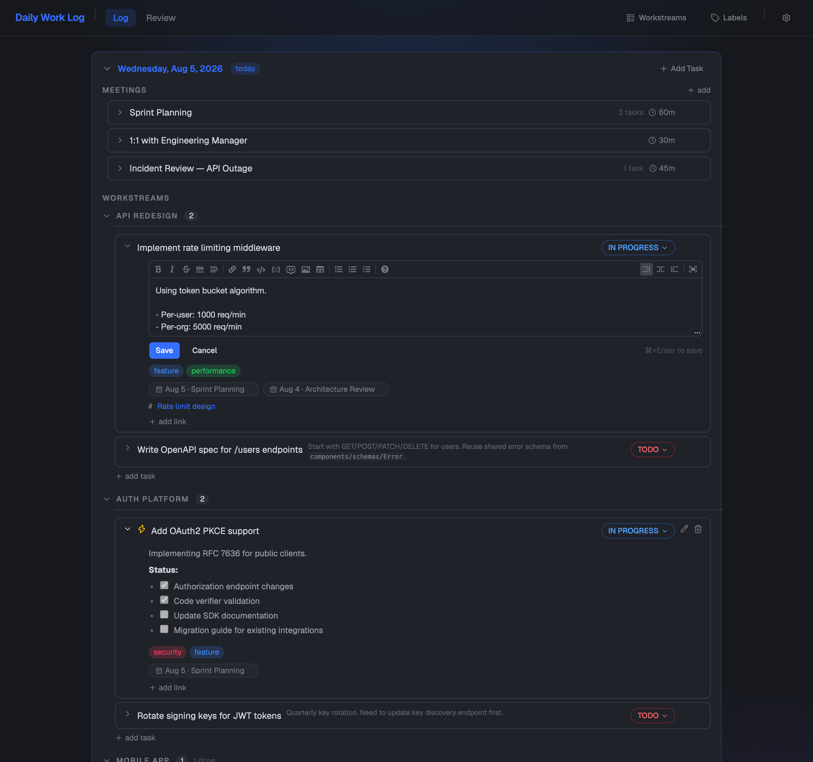

# Daily Work Log

A personal app for tracking daily tasks, meetings, and workstreams — built to make yearly reviews less painful and day-to-day work more visible.



## Features

- **Rolling day view** — configurable multi-day window with today expanded and previous days collapsed
- **Tasks** with state tracking (TODO → IN PROGRESS → DONE), workstream assignment, labels, links, and markdown notes
- **Meetings** with duration, markdown notes, and task linking — create tasks from meetings or link existing ones
- **Meeting-task linking** — see linked meetings on tasks (with date) and linked tasks on meetings; unlink with one click
- **Workstreams** — organize tasks into work areas; archive when done
- **Labels** — tag tasks with colored labels (18 preset colors), edit name and color inline
- **Links** — attach PRs, issues, docs, Slack threads; supports rich paste (copy a link from your browser, paste to auto-extract URL + label)
- **Click-to-edit markdown** — click rendered notes to edit, Cmd+Enter to save
- **Review page** — filter and browse all tasks with date range, state, workstream, label, and high-impact filters; export to markdown
- **Backup & restore** — JSON export/import of all data
- **Theme switcher** — Dark, Dim, and Light themes
- **Local-first** — all data stays in a local SQLite database

## Tech Stack

| Layer | Tech |
|-------|------|
| Backend | Python, FastAPI, SQLModel, SQLite |
| Frontend | React, TypeScript, Vite, Tailwind CSS v4 |
| UI Components | shadcn/ui (base-ui) |
| Markdown | react-markdown, remark-gfm, @uiw/react-md-editor |

## Getting Started

**Prerequisites:** Python 3.10+, Node.js 20+

```bash
# Install dependencies (creates venv, installs pip + npm packages)
make install

# Try it out with sample data (API on :8099, frontend on :4174)
make demo

# Start for real use (API on :8000, frontend on :5173)
make dev
```

The database (`api/worklog.db`) is created automatically on first run. Demo mode uses a separate sample database so your real data is never touched.

## Project Structure

```
api/                  Python FastAPI backend
  models.py           DB models + request/response types
  database.py         Engine, sessions, migrations
  routes/             REST endpoints (day, tasks, meetings, workstreams, labels, backup)

web/                  React + Vite + TypeScript frontend
  src/api/            API client, types, date utilities
  src/components/     UI components
  src/pages/          Page-level views (ReviewPage)

docs/                 Screenshots and documentation
```

## License

Personal project — not intended for distribution.
