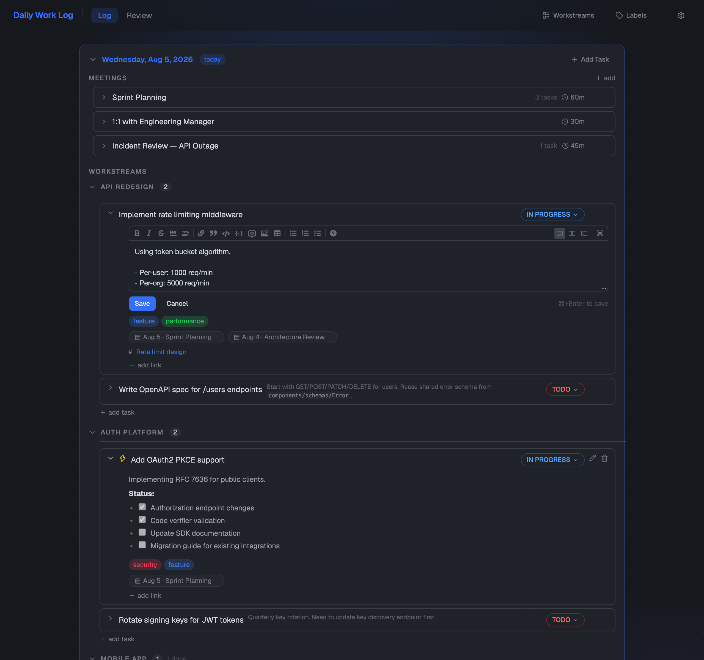

# Daily Work Log

A personal app for tracking daily tasks, meetings, and workstreams — built to make yearly reviews less painful and day-to-day work more visible.



## Features

- **Rolling day view** — configurable multi-day window (3/5/7/10/14 days) with today expanded and previous days collapsed
- **Content width** — Normal, Wide, Wider, Full-screen responsive layouts
- **Tasks** with state tracking (TODO / IN PROGRESS / DONE / ABANDONED), workstream assignment, labels, links, sub-tasks, and markdown notes
- **Sub-tasks** — one-level nesting via parent task; click "add sub-task" to inline-create directly
- **Meetings** with duration, markdown notes, and bi-directional task linking
- **Workstreams** — organize tasks into work areas; archive when done
- **Labels** — tag tasks with colored labels (18 preset colors)
- **Links** — attach PRs, issues, docs, Slack threads with rich paste support
- **Day status** — tag days with custom statuses (Sick, Vacation, etc.) with optional notes
- **On-call periods** — date-range on-call tracking with amber visual indicators
- **Click-to-edit markdown** — edit/preview tabs, Cmd+Enter to save, TODO keyword highlighting in red
- **Review page** — filter/browse all tasks by date range, state, workstream, label, and high-impact; export to markdown; on-call bell indicators
- **People & peer feedback** — track coworkers and log dated interactions about them, tagged against a customizable competency framework (dimensions + attributes) and marked as strength / growth / note; keep free-form notes per person; archive or delete people
- **Review Draft** — for a chosen person and date range, generate a peer-review draft that ranks "continue" and "focus more on" candidates, groups evidence by dimension, lists general notes, and exports to Markdown
- **Self-Review** — in the Review tab, generate a year-end summary of your own work: stat tiles, high-impact highlights, and tasks grouped by workstream, exportable to Markdown
- **Global search (⌘K)** — command palette to search across tasks, meetings, people, and interactions; jump straight to a result
- **Auto-backup** — daily JSON backup to a configurable folder (default `~/daily-work-log-backups`) with configurable retention (default 14 days); manual "Backup Now" button
- **Manual backup & restore** — JSON export/import of all data from Settings
- **Load past days** — load additional days or jump to a specific past date from the main view
- **Day visibility** — hide/show individual days (e.g. skip weekends)
- **Customizable** — app title, theme (Dark/Dim/Light), day window size, content width, weekend visibility; all settings persist
- **macOS auto-start** — launchd agent via `make install-agent`
- **Local-first** — all data in a local SQLite database

## Tech Stack

| Layer | Tech |
|-------|------|
| Backend | Python 3.10+, FastAPI, SQLModel, SQLite |
| Frontend | React 19, TypeScript 6, Vite 5, Tailwind CSS v4 |
| UI Components | shadcn/ui (base-ui) |
| Markdown | react-markdown, remark-gfm, rehype plugin for TODO highlighting |

## Getting Started

**Prerequisites:** Python 3.10+, Node.js 20+

```bash
# Install dependencies (creates venv, installs pip + npm packages)
make install

# Start for real use (API on :8000, frontend on :5173)
make dev

# Try with sample data (separate DB, API on :8099, frontend on :4174)
make demo
```

The database (`api/worklog.db`) is created automatically on first run. Demo mode uses a separate sample database.

## macOS Background Service

```bash
make install-agent   # Install and start launchd agent (runs at login)
make restart-agent   # Restart after code changes (no --reload in daemon mode)
make uninstall-agent # Stop and remove
make logs            # Tail agent logs
make open            # Open http://localhost:5173
```

## Project Structure

```
api/                  Python FastAPI backend
  main.py             App setup, lifespan, daily backup loop
  models.py           All DB models + request/response types
  database.py         Engine, sessions, migrations
  routes/             REST endpoints
    backup.py         Manual + auto backup, restore, status
    day.py            Day view (aggregated response)
    day_status.py     Day status tags
    day_visibility.py Day show/hide
    framework.py      Competency framework (dimensions + attributes) CRUD
    interactions.py   Interaction CRUD + competency tags
    labels.py         Label CRUD
    meetings.py       Meeting CRUD + task linking
    oncall.py         On-call period CRUD
    people.py         Person CRUD (+ archive)
    review_draft.py   Aggregated peer-review draft
    search.py         Global search across tasks/meetings/people/interactions
    self_review.py    Aggregated self-review of your own work
    settings.py       Key-value settings
    tasks.py          Task CRUD + sub-tasks + links
    workstreams.py    Workstream CRUD

web/                  React + Vite + TypeScript frontend
  src/api/            API client, types, date utilities
  src/components/     UI components (shadcn/ui based)
  src/pages/          Page-level views (ReviewPage)
  src/lib/            Utilities (rehype-highlight-todo)

scripts/              Startup, sample data, screenshots
Makefile              Dev, build, agent management targets
```

## Git

- Remote: `git@github-personal:corbantek/daily-work-log.git`
- GPG commit signing is enabled

## License

Personal project — not intended for distribution.
